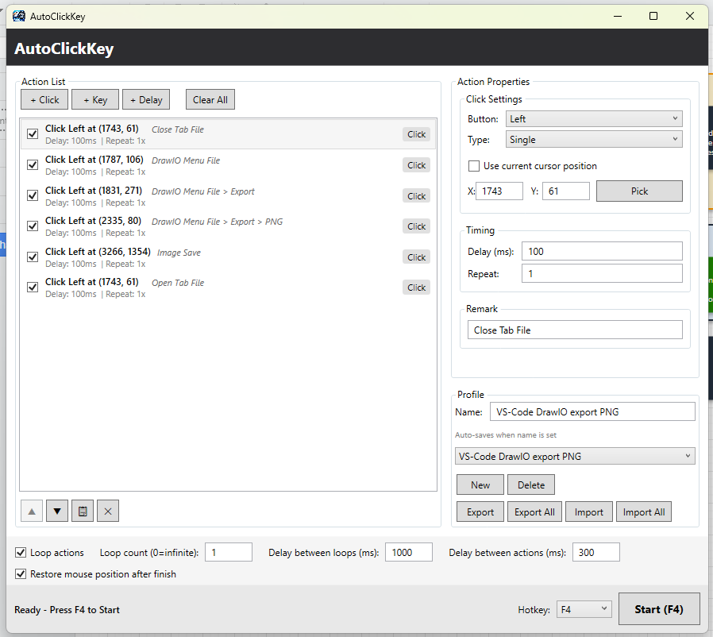

# AutoKeyClick — downloads

**A Windows automation tool for mouse-clicking and keyboard-input automation.**



This repository is the public **download home** for the packaged installers and
portable builds of [**AutoKeyClick**](https://github.com/MrParkerZ7/project-auto-key-click).
It holds no source code — every release here is built and published automatically
from the source repo when a version tag is pushed.

> ⬇️ **[Download the latest release →](../../releases/latest)**

---

## What is AutoKeyClick?

AutoKeyClick automates repetitive mouse and keyboard input on Windows — auto-clicking
at a set interval, typing text or key combinations, and recording/replaying input
sequences — with global hotkeys to start and stop. Built with C# / WPF on .NET 8.

## Key features

- **Auto clicker** — left / right / middle button, single or double click, custom
  millisecond interval, click at the current cursor or a fixed X/Y position, fixed
  repeat count or infinite loop.
- **Auto keyboard** — type text strings or press keys / combinations (Ctrl+C, Alt+Tab,
  …) on a custom interval, with repeat or infinite loop.
- **Record & playback** — record mouse movements, clicks, and keystrokes with timing,
  then replay them at original or custom speed; save recordings for reuse.
- **Profiles & presets** — save the current configuration as a named profile and
  switch between profiles; import/export to share between machines.
- **Global hotkeys** — start/stop (default `F6`) and emergency stop (default `F8`),
  with customizable bindings, so you can drive automation while another app is focused.

A fuller breakdown — default hotkeys, system requirements, and the platform matrix —
lives in **[SPEC.md](SPEC.md)**.

---

## Download & install

Grab the asset you want from the **[latest release](../../releases/latest)**. Every
release ships these Windows x64 builds:

| Build | File | Use when… |
|-------|------|-----------|
| **Installer** | `AutoKeyClick-<version>-setup.exe` | You want a normal install: Start-menu shortcut, optional desktop icon, uninstaller. Shows the MIT license agreement during setup. |
| **Portable (zip)** | `AutoKeyClick-<version>-win-x64-portable.zip` | No install — unzip and run `AutoKeyClick.exe`. |
| **Portable (exe)** | `AutoKeyClick-<version>-win-x64.exe` | A single double-click file, no unzip. |

Plus `SHA256SUMS.txt` for verification. All builds are **self-contained** — the .NET 8
runtime is bundled, so no separate runtime install is required.

### Per-build steps

- **Installer** — run `AutoKeyClick-<version>-setup.exe`, accept the MIT license, finish.
  Installs per-user (no admin). Launch from the Start menu; uninstall via *Settings → Apps*.
- **Portable zip** — unzip anywhere and run `AutoKeyClick.exe`. Delete the folder to remove.
- **Portable exe** — just double-click it.

### ⚠️ A note on code signing

These builds are **not code-signed**, so Windows SmartScreen may warn that the app is
from an unidentified developer:

- **Windows** — SmartScreen shows "Windows protected your PC" → **More info → Run anyway**.

Code signing is on the roadmap.

## Verify your download

```powershell
Get-FileHash .\AutoKeyClick-1.0.0-setup.exe -Algorithm SHA256
```
Compare the output against `SHA256SUMS.txt` from the same release.

---

## Releases & versioning

AutoKeyClick follows [Semantic Versioning](https://semver.org/). Each GitHub Release on
this repo carries its own auto-generated notes and the full asset set.

## How a release is cut (maintainers)

The source lives in **[`project-auto-key-click`](https://github.com/MrParkerZ7/project-auto-key-click)**.
Pushing a `vX.Y.Z` tag there runs its `Release` GitHub Actions workflow, which builds the
app on a Windows runner (portable exe + zip + Inno Setup installer) and publishes a
GitHub Release **here** with those assets.

**One-time setup:** the source repo needs a `RELEASE_PAT` secret — a token with
**Contents: read & write** on this repo — so its workflow can publish here (a repo's
`GITHUB_TOKEN` is scoped to its own repo only).

## License & policies

| Document | What it covers |
|----------|----------------|
| **[LICENSE](LICENSE)** | MIT — same license as the source project. |
| **[EULA](EULA.md)** | End-user license agreement (also shown on the installer's agreement page). |
| **[THIRD-PARTY-LICENSES](THIRD-PARTY-LICENSES.md)** | Attribution for the bundled .NET runtime and components. |

**Acceptable use** — AutoKeyClick automates mouse and keyboard input; use it lawfully and in
accordance with the terms of any software, game, or service you use it with. The software is
provided **"AS IS", with no warranty** (MIT).

**Security** — found a vulnerability? Please report it privately via the source repository's
private vulnerability reporting rather than a public issue.
