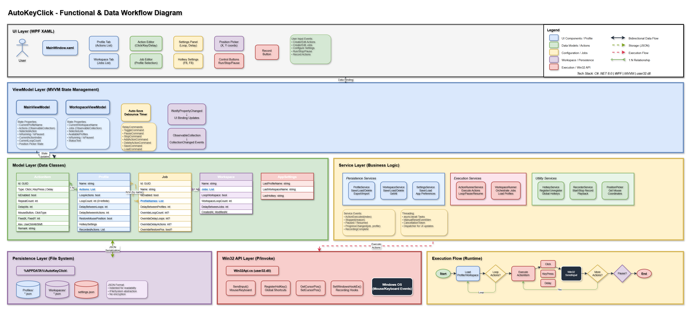

# AutoKeyClick — specification & user guide

A reference for what **AutoKeyClick** does and how to use it. For download and install
steps, see the [README](README.md). For engineering-level design (architecture, code,
tests), see the [source repository](https://github.com/MrParkerZ7/project-auto-key-click).

> Applies to **v1.0.0**.

---

## 1. Overview

AutoKeyClick is a Windows desktop tool that automates repetitive mouse and keyboard
input — clicking at a set rate, typing text or key combinations, and recording and
replaying input sequences. It runs in the foreground with global hotkeys, so you can
start and stop automation while another application is focused.

## 2. Auto clicker

| Setting | Options |
|---------|---------|
| **Click type** | Left · Right · Middle mouse button |
| **Click mode** | Single click · Double click |
| **Interval** | Custom delay between clicks, in milliseconds |
| **Position** | At the current cursor position, or at fixed X / Y coordinates |
| **Repeat** | A specific repeat count, or an infinite loop until stopped |

## 3. Auto keyboard

| Setting | Options |
|---------|---------|
| **Text typing** | Automatically type a text string |
| **Key press** | Press single keys or combinations (e.g. `Ctrl+C`, `Alt+Tab`) |
| **Interval** | Custom delay between keystrokes, in milliseconds |
| **Repeat** | A specific repeat count, or an infinite loop |

## 4. Record & playback

- **Record** mouse movements, clicks, and positions, plus keyboard inputs and their
  timing.
- **Playback** replays the recorded actions at their original timing or a custom speed.
- **Save / export** recordings for later reuse.

## 5. Profiles & presets

- **Save** the current configuration as a named profile.
- **Load** a saved profile to switch configurations instantly.
- **Import / export** profiles to share them between machines.

## 6. Global hotkeys

Default bindings (all customizable):

| Action | Hotkey |
|--------|--------|
| Start / Stop | `F6` |
| Emergency Stop | `F8` |
| Record | `Ctrl+R` |
| Play Recording | `Ctrl+P` |

Hotkeys are global — they work while another application is focused, so you can drive
automation without switching back to AutoKeyClick.

## 7. Platform support

| Platform | Architecture | Artifacts |
|----------|--------------|-----------|
| Windows 10 / 11 | x64 | Inno Setup installer `.exe` · portable `.zip` · single-file `.exe` |

**System requirements**

- **Windows** 10 or 11 (x64).
- **No separate runtime required** — the .NET 8 runtime is bundled in every build
  (self-contained).

## 8. Known limitations & roadmap

- **Code signing** — builds are currently unsigned; expect a SmartScreen prompt (see the
  [README](README.md#%EF%B8%8F-a-note-on-code-signing) for the bypass). Signing is planned.
- **Dark/light theme** and **system-tray integration** are planned.
- Windows-only — there is no macOS or Linux build (the app uses the Win32 input APIs).

## Architecture & data flow

How the layers fit together — UI (WPF / XAML) → ViewModels (MVVM state) → models →
services (clicker · keyboard · recorder · hotkeys · profiles) → the Win32 input layer,
plus the runtime execution flow. Editable source:
[`docs/data-workflow-diagram.drawio`](docs/data-workflow-diagram.drawio) (open with draw.io / diagrams.net).

## 9. Links

- **Source & engineering docs** — <https://github.com/MrParkerZ7/project-auto-key-click>
- **Downloads / releases** — [latest release](../../releases/latest)
- **Architecture diagram** — see [Architecture & data flow](#architecture--data-flow) above
- **Legal** — [LICENSE](LICENSE) (MIT) · [EULA](EULA.md) · [THIRD-PARTY-LICENSES](THIRD-PARTY-LICENSES.md)

## Disclaimer

AutoKeyClick automates mouse and keyboard input. You are responsible for using it
lawfully and in accordance with the terms of any software, game, or service you use it
with. The software is provided "AS IS" with no warranty (see the MIT License).
